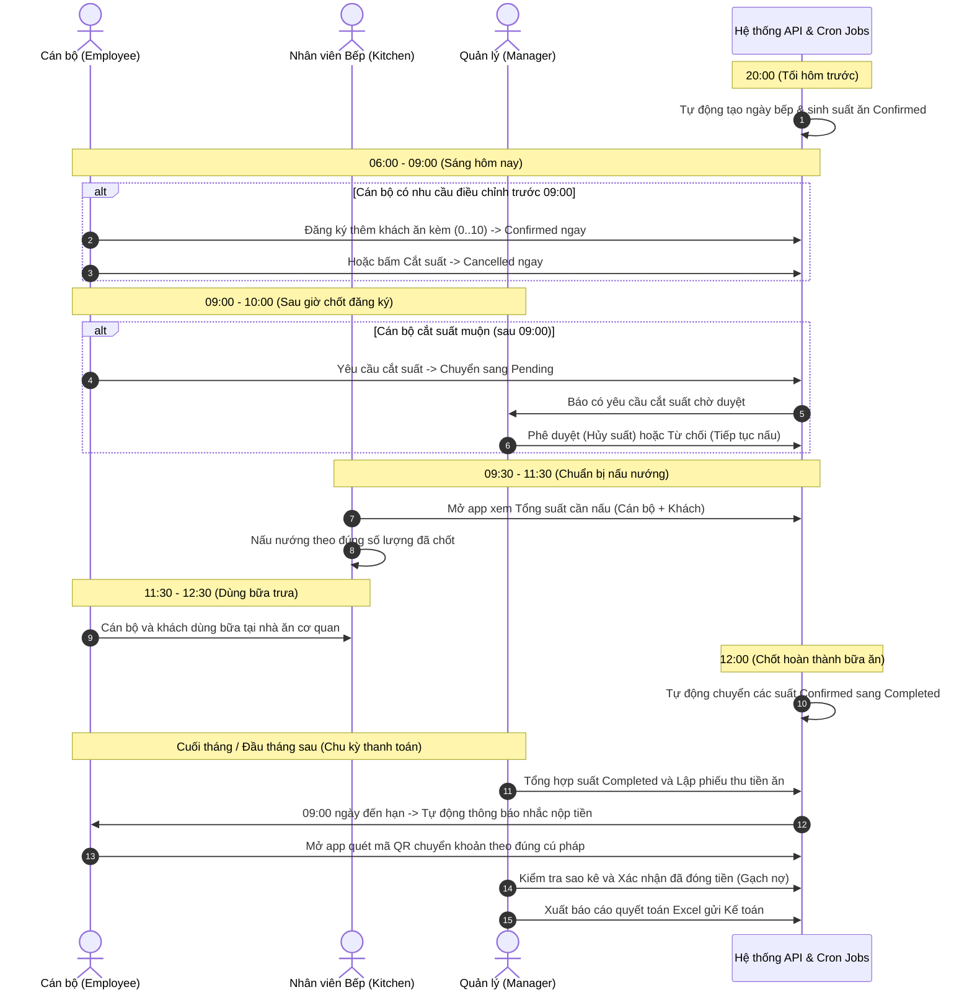

# TÀI LIỆU HƯỚNG DẪN SỬ DỤNG HỆ THỐNG QUẢN LÝ SUẤT ĂN LCIT MEAL

> **Phiên bản tài liệu**: 2.1  
> **Cập nhật ngày**: 25/09/2026  
> **Áp dụng cho**: Hệ thống LCIT Meal (Backend API Express + Mobile App React Native Expo)

---

## MỤC LỤC

1. [TỔNG QUAN HỆ THỐNG](#1-tổng-quan-hệ-thống)
   - 1.1. Mục đích và phạm vi
   - 1.2. Danh sách vai trò & Phân quyền
   - 1.3. Tài khoản thử nghiệm mặc định
2. [CÁC LUỒNG HOẠT ĐỘNG CHÍNH XUYÊN SUỐT (CORE WORKFLOWS)](#2-các-luồng-hoạt-động-chính-xuyên-suốt-core-workflows)
   - 2.1. Sơ đồ chuỗi tương tác tổng quan giữa các vai trò & hệ thống
   - 2.2. Luồng chính 1: Chu kỳ phục vụ suất ăn hằng ngày (Daily Meal Operational Flow)
   - 2.3. Luồng chính 2: Chu kỳ quản lý công nợ & thu tiền ăn hằng tháng (Monthly Billing & Payment Flow)
   - 2.4. Luồng chính 3: Chu kỳ thiết lập cấu hình & vận hành của Quản trị viên (Admin Setup & Operations Flow)
3. [HƯỚNG DẪN CÀI ĐẶT & KẾT NỐI HỆ THỐNG](#3-hướng-dẫn-cài-đặt--kết-nối-hệ-thống)
   - 3.1. Khởi chạy Backend API & Database
   - 3.2. Khởi chạy Mobile App
   - 3.3. Cấu hình kết nối API & Chế độ Dữ liệu mẫu (Mock Demo)
4. [QUY TRÌNH & HƯỚNG DẪN CHO CÁN BỘ NHÂN VIÊN (EMPLOYEE)](#4-quy-trình--hướng-dẫn-cho-cán-bộ-nhân-viên-employee)
   - Luồng E1: Đăng nhập & Đổi mật khẩu
   - Luồng E2: Xem lịch ăn & Đăng ký suất ăn
   - Luồng E3: Đăng ký thêm khách ăn kèm (0–10 khách)
   - Luồng E4: Cắt suất ăn trực tiếp (Trước & Sau giờ chốt)
   - Luồng E5: Báo cắt suất theo yêu cầu (Hôm nay / Khoảng ngày / Dài hạn)
   - Luồng E6: Theo dõi công nợ & Quét mã QR thanh toán
   - Luồng E7: Nhận và quản lý hộp thư thông báo
   - Luồng E8: Quản lý hồ sơ cá nhân
5. [QUY TRÌNH & HƯỚNG DẪN CHO QUẢN LÝ BẾP (MANAGER)](#5-quy-trình--hướng-dẫn-cho-quản-lý-bếp-manager)
   - Luồng M1: Bảng điều khiển Quản lý & Biểu đồ thống kê
   - Luồng M2: Duyệt / Từ chối yêu cầu cắt suất ăn (Hàng chờ Pending)
   - Luồng M3: Quản lý Lịch nấu bếp & Sự kiện nghỉ lễ
   - Luồng M4: Quản lý danh sách suất ăn, Thao tác hộ & Xuất Excel
   - Luồng M5: Quản lý thu tiền ăn & Xác nhận hoàn tất đóng tiền
   - Luồng M6: Soạn thảo và Phát thông báo cơ quan
   - Luồng M7: Tra cứu danh sách cán bộ
   - Luồng M8: Kích hoạt công cụ định kỳ (Chạy sinh lịch / Chốt hoàn thành)
6. [QUY TRÌNH & HƯỚNG DẪN CHO QUẢN TRỊ VIÊN HỆ THỐNG (ADMIN)](#6-quy-trình--hướng-dẫn-cho-quản-trị-viên-hệ-thống-admin)
   - Luồng A1: Quản lý tài khoản cán bộ & Phân quyền vai trò
   - Luồng A2: Cấu hình hệ thống (Lịch thứ, Đơn giá, Giờ chốt, Ảnh QR)
   - Luồng A3: Kiểm tra Nhật ký hệ thống (Audit Logs)
   - Luồng A4: Quyền can thiệp & Xóa dữ liệu lịch sử
7. [QUY TRÌNH & HƯỚNG DẪN CHO NHÂN VIÊN BẾP (KITCHEN)](#7-quy-trình--hướng-dẫn-cho-nhân-viên-bếp-kitchen)
   - Luồng K1: Đăng nhập & Theo dõi số suất cần nấu hôm nay
   - Luồng K2: Phân biệt suất cán bộ và suất khách mời
8. [BẢNG TRA CỨU TRẠNG THÁI NGHIỆP VỤ](#8-bảng-tra-cứu-trạng-thái-nghiệp-vụ)
9. [CÂU HỎI THƯỜNG GẶP (FAQ) & XỬ LÝ SỰ CỐ](#9-câu-hỏi-thường-gặp-faq--xử-lý-sự-cố)

---

## 1. TỔNG QUAN HỆ THỐNG

### 1.1. Mục đích và phạm vi
**LCIT Meal** là giải pháp số hóa toàn diện quy trình phục vụ bữa ăn trưa nội bộ cho cơ quan, đơn vị:
- **Tự động hóa đăng ký**: Tự động lên lịch ăn cho toàn bộ nhân viên theo lịch làm việc thứ 2 đến thứ 6.
- **Linh hoạt cắt suất**: Cho phép nhân viên chủ động báo cắt suất, đăng ký thêm khách ăn kèm ngay trên điện thoại di động.
- **Minh bạch tài chính**: Quản lý số suất thực tế, công nợ tiền ăn từng tháng, hỗ trợ quét mã QR chuyển khoản và xuất báo cáo đối soát Excel.
- **Hỗ trợ bếp ăn**: Dự báo chính xác số lượng suất ăn cần nấu mỗi ngày, tránh lãng phí thực phẩm.

Hệ thống gồm 2 thành phần chính:
1. **Backend API (`lcit-meal-api`)**: Nền tảng Node.js + Express 5 + MySQL/MariaDB, xử lý xác thực JWT, lập lịch định kỳ (`node-cron`), quản lý tập trung nghiệp vụ và lưu vết audit log.
2. **Mobile App (`lcit-meal-mobile`)**: Ứng dụng di động đa nền tảng React Native (Expo SDK 57 + TypeScript), hỗ trợ Android, iOS và Web, tích hợp song song chế độ **Dữ liệu mẫu (Mock)** và **API thật**.

---

### 1.2. Danh sách vai trò & Phân quyền

Hệ thống phân định rành mạch 4 vai trò người dùng:

| Vai trò (Role) | Mã quyền | Quyền hạn & Trách nhiệm chính |
| :--- | :--- | :--- |
| **Cán bộ Nhân viên**<br>*(Employee)* | `employee` | • Xem lịch ăn cá nhân các ngày trong tháng.<br>• Đăng ký suất ăn, đăng ký thêm từ 1–10 khách kèm.<br>• Cắt suất hôm nay hoặc gửi yêu cầu cắt theo khoảng ngày / dài hạn.<br>• Xem công nợ tiền ăn cá nhân, quét mã QR thanh toán.<br>• Nhận thông báo cá nhân, cập nhật hồ sơ & đổi mật khẩu. |
| **Quản lý Bếp**<br>*(Manager)* | `manager` | • Toàn bộ quyền của Cán bộ nhân viên.<br>• Xem Dashboard thống kê số suất cần nấu, biểu đồ suất ăn thực tế.<br>• Phê duyệt hoặc từ chối yêu cầu cắt suất muộn (Pending).<br>• Tạo, chỉnh sửa lịch nấu ăn và sự kiện nghỉ lễ.<br>• Đăng ký suất hoặc cắt suất hộ cán bộ khác.<br>• Quản lý thu tiền ăn, xác nhận đã nộp tiền, xuất Excel báo cáo.<br>• Soạn và gửi thông báo cơ quan (broadcast hoặc chọn người nhận).<br>• Kích hoạt thủ công tiến trình sinh lịch và chốt hoàn thành suất. |
| **Quản trị viên**<br>*(Admin)* | `admin` | • Toàn quyền tối cao của hệ thống (kế thừa Quản lý).<br>• Tạo mới người dùng, kích hoạt/khóa tài khoản, phân quyền Role.<br>• Cấu hình hệ thống: Lịch thứ trong tuần, đơn giá suất ăn, giờ đóng đăng ký, giờ chốt hoàn thành, tải lên mã QR ngân hàng.<br>• Tra cứu Nhật ký hệ thống (Audit Logs) kiểm soát an toàn thông tin.<br>• Xóa ngày bếp, xóa bản ghi thanh toán khi cần điều chỉnh đặc biệt.<br>*(Lưu ý: Admin không tự đăng ký suất ăn cho bản thân).* |
| **Nhân viên Bếp**<br>*(Kitchen)* | `kitchen` | • Giao diện tinh gọn dành riêng cho bộ phận nấu nướng.<br>• Xem tổng số suất cần chuẩn bị hôm nay (tách rõ cán bộ & khách kèm).<br>• Xem trạng thái bếp hoạt động hay nghỉ phục vụ.<br>• Không truy cập các phân hệ quản lý tài chính và nhân sự. |

---

### 1.3. Tài khoản thử nghiệm mặc định

Mật khẩu mặc định cho tất cả tài khoản dùng thử là **`123456`**:

| Vai trò | Tên đăng nhập (Username) | Mật khẩu | Chú thích |
| :--- | :--- | :--- | :--- |
| **Admin** | `admin` | `123456` | Quản trị viên cao nhất hệ thống |
| **Manager** | `manager` | `123456` | Quản lý bếp & phụ trách hành chính |
| **Employee** | `user1` | `123456` | Cán bộ nhân viên tiêu biểu (có thể dùng `user2`, `user3`) |
| **Kitchen** | `kitchen` | `123456` | Bộ phận phụ trách nấu bếp |

---

## 2. CÁC LUỒNG HOẠT ĐỘNG CHÍNH XUYÊN SUỐT (CORE WORKFLOWS)

Đây là bức tranh tổng thể thể hiện cách thức các vai trò **Cán bộ nhân viên**, **Nhân viên bếp**, **Quản lý** và **Hệ thống tự động** phối hợp nhịp nhàng với nhau trong thực tế.

### 2.1. Sơ đồ chuỗi tương tác tổng quan



---

### 2.2. Luồng chính 1: Chu kỳ phục vụ suất ăn hằng ngày (Daily Meal Operational Flow)

Đây là luồng nghiệp vụ quan trọng nhất, diễn ra đều đặn từ thứ 2 đến thứ 6 mỗi tuần theo mốc thời gian:

```
[20:00 Tối qua]        [06:00 - 09:00]          [09:00 - 10:00]          [09:30 - 11:30]         [11:30 - 12:30]       [12:00 Trưa]
Tự động sinh suất  ➔  Cán bộ kiểm tra/cắt  ➔  Quản lý duyệt muộn   ➔  Nhà bếp nấu nướng  ➔   Dùng bữa trưa    ➔   Chốt hoàn thành
  (Confirmed)           (Trước giờ chốt)          (Hàng chờ Pending)      (Theo số app chốt)      (Tại nhà ăn)           (Completed)
```

#### Bước 1: Tự động lên lịch & suất ăn (20:00 tối hôm trước)
- Tiến trình nền `autoScheduleJob` kích hoạt tự động.
- Hệ thống kiểm tra cấu hình lịch thứ (Thứ 2 đến Thứ 6), loại bỏ các ngày nghỉ lễ đã lên lịch trước và những cán bộ có yêu cầu cắt suất dài hạn còn hiệu lực.
- Tự động tạo bản ghi ngày bếp (`meal`) và đăng ký suất ăn mặc định (`meal_registration` với `status = confirmed`) cho toàn bộ cán bộ nhân viên đang hoạt động (`active`).
- **Ý nghĩa**: Cán bộ không cần phải nhớ bấm đăng ký mỗi ngày; giảm thiểu tối đa quên sót.

#### Bước 2: Cán bộ kiểm tra & điều chỉnh suất (06:00 – 09:00 sáng)
- Cán bộ mở app, màn hình Trang chủ hiển thị ngay trạng thái: **Đã xác nhận** suất ăn trưa nay.
- **Nếu có khách mời/đối tác**: Cán bộ nhấn **"Đổi khách"**, chọn số lượng từ 1–10. Suất khách được chấp nhận ngay lập tức, không qua khâu phê duyệt.
- **Nếu bận việc/không ăn**: Cán bộ nhấn **"Cắt suất"** trước 09:00 sáng. Hệ thống hủy suất ngay lập tức (`status = cancelled`), bếp sẽ trừ bớt 1 suất.

#### Bước 3: Giờ chốt & Xử lý cắt suất muộn (09:00 – 10:00 sáng)
- Đúng **09:00 sáng** (`registration_close_time` theo cấu hình): Nhà bếp bắt đầu chuẩn bị thực phẩm.
- **Nếu cán bộ cắt suất sau 09:00**:
  - Ứng dụng không tự hủy mà chuyển suất ăn sang trạng thái **"Chờ duyệt" (Pending)**.
  - Quản lý mở Bảng điều khiển Quản lý ➔ Hàng chờ duyệt cắt suất ➔ Nhấn **"Duyệt cắt"** (nếu bếp chưa nấu) hoặc **"Từ chối"** (nếu khẩu phần đã vào nồi).

#### Bước 4: Nhà bếp xem số liệu chốt & Nấu nướng (09:30 – 11:30 trưa)
- Nhân viên bếp đăng nhập tài khoản `kitchen`, màn hình hiển thị trực quan con số to nhất: **Tổng số suất ăn cần chuẩn bị**.
- Xem chi tiết: Số suất Cán bộ + Số suất Khách mời.
- Bếp nấu đúng số lượng thực tế đã chốt, đảm bảo chất lượng và loại bỏ lãng phí.

#### Bước 5: Phục vụ bữa trưa (11:30 – 12:30 trưa)
- Cán bộ và khách đến nhà ăn cơ quan dùng bữa.

#### Bước 6: Tự động chốt hoàn thành suất ăn (12:00 trưa)
- Đúng **12:00 trưa** (`meal_completion_time`), tiến trình `mealCompletionJob` tự động quét tất cả các suất ăn đang `confirmed` của ngày hôm nay và chuyển sang `completed`.
- Suất ăn đã `completed` được xem là bất biến, làm căn cứ chính xác 100% để tính chi phí ăn uống cuối tháng.

---

### 2.3. Luồng chính 2: Chu kỳ quản lý công nợ & thu tiền ăn hằng tháng (Monthly Billing & Payment Flow)

Luồng nghiệp vụ xử lý tài chính định kỳ vào cuối tháng và đầu tháng sau:

```
[Cuối tháng]                 [Đầu tháng]                  [09:00 Ngày đến hạn]           [Cán bộ đóng tiền]             [Quản lý gạch nợ]             [Quyết toán]
Tổng hợp suất ăn       ➔   Lập phiếu thu tiền     ➔      Hệ thống nhắc nợ          ➔   Quét QR chuyển khoản    ➔     Xác nhận "Đã đóng"      ➔    Xuất báo cáo
 (Số suất Completed)          (Trạng thái Unpaid)           (Tự động báo qua app)          (Kèm đúng cú pháp)            (Lưu vết chứng từ)            (File Excel)
```

#### Bước 1: Tổng hợp số lượng suất ăn thực tế (Cuối tháng)
- Quản lý vào Bảng điều khiển Quản lý ➔ Xem biểu đồ thống kê chu kỳ **Tháng**.
- Hệ thống đếm chính xác số suất `completed` của từng cán bộ (đã bao gồm các bữa có khách ăn kèm).

#### Bước 2: Lập phiếu thu tiền ăn cho cán bộ (Đầu tháng)
- Quản lý truy cập: **Quản lý Thu tiền** ➔ nhấn **"Tạo khoản thu"**.
- Chọn cán bộ, chọn ngày phát hành phiếu thu (ví dụ ngày 25 hàng tháng), nhập số tiền cần đóng (VND), trạng thái ban đầu là `Unpaid` (Chưa thanh toán).

#### Bước 3: Tự động gửi thông báo nhắc nợ (09:00 ngày đến hạn)
- Đến ngày quy định thu tiền (`payment_due_day`, ví dụ ngày 10 hàng tháng), tiến trình `paymentReminderJob` kích hoạt lúc 09:00 sáng.
- Hệ thống tự động gửi thông báo trực tiếp đến điện thoại của tất cả cán bộ có khoản nợ tiền ăn chưa hoàn tất.

#### Bước 4: Cán bộ quét mã QR thanh toán qua App
- Cán bộ vào tab **"Thanh toán"** trên ứng dụng ➔ Thấy rõ khoản nợ kèm hạn nộp.
- Nhấn **"Quét mã QR"**: App hiển thị mã QR tài khoản ngân hàng của cơ quan và cú pháp gợi ý:  
  `TIEN AN THANG [X] - [HỌ TÊN] - [USERNAME]`.
- Cán bộ mở App ngân hàng quét mã và chuyển tiền nhanh chóng.

#### Bước 5: Quản lý đối soát và Gạch nợ
- Khi nhận được tiền báo về tài khoản ngân hàng, Quản lý vào mục **Quản lý Thu tiền** ➔ tìm khoản nợ của cán bộ ➔ nhấn **"Xác nhận đã đóng"**.
- Quản lý nhập số tiền thực nhận (mặc định bằng số tiền phiếu thu), dán đường dẫn ảnh bill chuyển khoản (nếu cần đối soát) ➔ Bấm **Lưu xác nhận**.
- Trạng thái lập tức đổi sang `Paid` (Đã thanh toán) và thông báo chúc mừng hiển thị trên app của cán bộ.

#### Bước 6: Xuất báo cáo quyết toán Excel
- Quản lý hoặc Admin bấm biểu tượng **Xuất Excel** tại màn hình Quản lý Thu tiền.
- File bảng tính Excel chuẩn xác thực được tải về và mở chia sẻ (Zalo, Email, Drive) để bàn giao bộ phận kế toán quyết toán.

---

### 2.4. Luồng chính 3: Chu kỳ thiết lập cấu hình & vận hành của Quản trị viên (Admin Setup & Operations Flow)

Luồng thiết lập nền móng ban đầu và xử lý các tình huống đột xuất:

```
[1. Phân quyền User]      ➔      [2. Cài đặt Cấu hình]      ➔      [3. Xử lý Lịch nghỉ/Bếp]      ➔      [4. Giám sát Audit Logs]
Tạo tài khoản, gán Role           Lịch thứ, Đơn giá,                Tạo sự kiện nghỉ lễ,                 Xem lịch sử thao tác,
(Admin, Manager, User, Bếp)       Giờ chốt 09:00 & 12:00, QR        Hủy/Mở bếp đột xuất                  bảo vệ an toàn dữ liệu
```

#### Bước 1: Khởi tạo tài khoản & Phân quyền cán bộ
- Admin truy cập **Người dùng & Vai trò** ➔ bấm **"Thêm người dùng"**.
- Nhập thông tin, hệ thống tự động kiểm tra trùng lặp `username`.
- Gán đúng vai trò theo vị trí công tác:
  - `Admin`: Người quản trị tối cao (không tự ăn).
  - `Manager`: Phụ trách bếp và hành chính (được ăn bình thường).
  - `Employee`: Toàn thể cán bộ nhân viên công ty.
  - `Kitchen`: Bộ phận phụ trách nấu nướng.

#### Bước 2: Thiết lập cấu hình hệ thống
- Admin truy cập **Cấu hình hệ thống**:
  - **Lịch thứ**: Bật Thứ 2 đến Thứ 6, tắt Thứ 7 và Chủ nhật.
  - **Đơn giá**: Cài đặt giá suất ăn cán bộ (ví dụ: `30,000` đ) và giá suất khách (ví dụ: `35,000` đ).
  - **Giờ chốt đăng ký (`registration_close_time`)**: Đặt `09:00` sáng.
  - **Giờ hoàn thành (`meal_completion_time`)**: Đặt `12:00` trưa.
  - **Ảnh mã QR**: Tải lên ảnh mã QR tài khoản ngân hàng nhận tiền ăn.

#### Bước 3: Điều phối lịch nghỉ lễ & Hủy bếp đột xuất
- **Dịp lễ, Tết**: Quản lý/Admin vào **Lịch bếp & Nghỉ lễ** ➔ Tạo sự kiện nghỉ lễ (từ ngày... đến ngày...). Hệ thống tự động đóng bếp và hủy toàn bộ các suất ăn trong khoảng thời gian này.
- **Sự cố đột xuất (mất điện, sửa chữa)**: Quản lý chọn ngày ăn hôm nay ➔ Nhấn **"Hủy bếp"** ➔ Nhập lý do. Hệ thống tự động phát thông báo khẩn cấp tới toàn bộ nhân viên.

#### Bước 4: Giám sát an toàn thông tin (Audit Logs)
- Admin vào **Nhật ký hệ thống** để theo dõi mọi biến động: Ai vừa đổi mật khẩu, ai vừa sửa lịch bếp, ai vừa duyệt cắt suất, thời điểm và địa chỉ IP thực hiện. Đảm bảo tính minh bạch và truy cứu trách nhiệm khi có tranh chấp.

---

## 3. HƯỚNG DẪN CÀI ĐẶT & KẾT NỐI HỆ THỐNG

### 3.1. Khởi chạy Backend API & Database

1. **Khởi động Database MySQL**:
   - Sử dụng Docker Compose tại thư mục gốc:
     ```bash
     docker-compose up -d
     ```
   - Hoặc cài đặt MySQL 8.0 local và import file `qlsa.sql`.
2. **Khởi chạy API Server**:
   ```bash
   cd lcit-meal-api
   npm install
   npm run dev
   ```
   API mặc định chạy tại: `http://localhost:3000/api`.

---

### 3.2. Khởi chạy Mobile App

```bash
cd lcit-meal-mobile
npm install
npx expo start
```
- Nhấn phím `a` để mở trên Android Emulator.
- Nhấn phím `i` để mở trên iOS Simulator (yêu cầu macOS).
- Nhấn phím `w` để mở trên Trình duyệt Web (khuyến nghị để xem thử nghiệm nhanh).
- Hoặc dùng camera điện thoại quét mã QR qua ứng dụng **Expo Go**.

---

### 3.3. Cấu hình kết nối API & Chế độ Dữ liệu mẫu (Mock Demo)

Ứng dụng hỗ trợ cơ chế chuyển đổi linh hoạt:
- **Chế độ Mock (Dữ liệu mẫu)**: Cho phép trải nghiệm toàn bộ tính năng và phân quyền ngay lập tức mà không cần kết nối máy chủ hay database.
- **Chế độ API thật**: Kết nối trực tiếp vào máy chủ backend.

**Cách chuyển đổi:**
1. Vào tab **Tài khoản** (Góc dưới bên phải màn hình).
2. Cuộn xuống mục **Môi trường & Kết nối**:
   - Gạt công tắc **"Chế độ dữ liệu mẫu (Mock)"**:
     - *Bật (Xanh)*: Chạy offline độc lập với dữ liệu mẫu chuẩn.
     - *Tắt (Xám)*: Ứng dụng gọi REST API thật qua mạng.
   - Nhấn **"Đổi máy chủ API"**:
     - Android Emulator: nhập `http://10.0.2.2:3000/api`
     - iOS Simulator / Web: nhập `http://localhost:3000/api`
     - Điện thoại thật qua Wi-Fi LAN: nhập `http://<IP-máy-tính>:3000/api` (Ví dụ: `http://192.168.1.15:3000/api`).

---

## 4. QUY TRÌNH & HƯỚNG DẪN CHO CÁN BỘ NHÂN VIÊN (EMPLOYEE)

### Luồng E1: Đăng nhập & Đổi mật khẩu
1. Mở ứng dụng, nhập **Tên đăng nhập** (`user1`) và **Mật khẩu** (`123456`).
2. Nhấn nút **"Đăng nhập"**.
3. Để đổi mật khẩu cá nhân:
   - Vào tab **Tài khoản** ➔ chọn **"Chỉnh sửa hồ sơ"**.
   - Nhập mật khẩu hiện tại, mật khẩu mới và xác nhận mật khẩu mới.
   - Nhấn **"Lưu thay đổi"**.

---

### Luồng E2: Xem lịch ăn & Đăng ký suất ăn
Theo mặc định, hệ thống chạy tiến trình tự động đăng ký suất ăn trưa các ngày từ Thứ 2 đến Thứ 6. Tuy nhiên, cán bộ có thể chủ động kiểm tra và đăng ký lại:

1. **Xem trên Trang chủ**:
   - Ngay đầu màn hình Trang chủ hiển thị thẻ **"Suất ăn hôm nay"**.
   - Cán bộ xem được ngày ăn, trạng thái (*Đã đăng ký*, *Chưa đăng ký*, hoặc *Bếp nghỉ*), số khách kèm và giờ chốt quy định.
2. **Xem trên Lịch ăn tháng (Tab "Lịch ăn")**:
   - Chọn tháng và xem danh sách tất cả các ngày trong tháng.
   - Nhãn trạng thái màu sắc trực quan:
     - 🟢 **Đã xác nhận**: Đã đăng ký thành công.
     - 🟡 **Chờ duyệt**: Đang đợi quản lý phê duyệt.
     - 🔵 **Đã hoàn thành**: Suất ăn đã diễn ra qua trưa.
     - ⚪ **Đã cắt / Chưa đăng ký**: Chưa có suất ăn cho ngày này.
     - 🔴 **Bếp nghỉ**: Nhà bếp không phục vụ.
3. **Đăng ký ăn một ngày cụ thể**:
   - Nhấn vào ngày muốn đăng ký trên lịch hoặc nhấn nút **"Đăng ký ăn"** trên thẻ.
   - Hệ thống lập tức ghi nhận và chuyển trạng thái sang **Đã xác nhận**.

---

### Luồng E3: Đăng ký thêm khách ăn kèm (0–10 khách)
Khi có khách, đối tác hoặc đồng nghiệp cần dùng bữa cùng:
1. Tại thẻ suất ăn (ở Trang chủ, Lịch ăn hoặc Chi tiết ngày ăn), nhấn vào nút **"Đổi khách"** hoặc biểu tượng người kèm.
2. Hộp thoại **"Cập nhật số khách ăn kèm"** xuất hiện.
3. Sử dụng nút `+` hoặc `-` để điều chỉnh số lượng khách (giới hạn từ **0 đến 10 khách**).
4. Nhấn **"Lưu thay đổi"**.
5. *Lưu ý*: Suất khách **được xác nhận ngay lập tức**, không cần đợi quản lý phê duyệt. Quản lý bếp sẽ tự động nhận được thông báo để kịp chuẩn bị thêm khẩu phẩm.

---

### Luồng E4: Cắt suất ăn trực tiếp (Trước & Sau giờ chốt)
Khi bận công tác, nghỉ phép hoặc không có nhu cầu ăn trưa:

#### Tình huống A: Cắt suất TRƯỚC giờ chốt (Mặc định trước 09:00 sáng)
1. Tại thẻ suất ăn của ngày hôm nay, nhấn nút **"Cắt suất"**.
2. Hộp thoại xác nhận hiện ra, nhấn **"Đồng ý cắt suất"**.
3. **Kết quả**: Suất ăn chuyển ngay sang trạng thái **"Đã cắt" (Cancelled)**. Số lượng suất ăn của bếp lập tức giảm đi 1.

#### Tình huống B: Cắt suất SAU giờ chốt (Từ 09:00 đến trước 12:00 trưa)
1. Tại thẻ suất ăn, nhấn nút **"Cắt suất"**.
2. Xác nhận đồng ý cắt suất.
3. **Kết quả**: Do đã quá giờ chốt của nhà bếp, hệ thống không tự hủy mà chuyển trạng thái suất sang **"Chờ duyệt" (Pending)**.
4. Màn hình hiển thị thông báo: *"Đã quá giờ đóng đăng ký, yêu cầu cắt suất của bạn đã được chuyển cho Quản lý xét duyệt"*.
5. Cán bộ chỉ cần chờ Quản lý bấm duyệt trên hệ thống.

---

### Luồng E5: Báo cắt suất theo yêu cầu (Hôm nay / Khoảng ngày / Dài hạn)
Để cắt trước nhiều ngày (ví dụ đi công tác 1 tuần hoặc nghỉ chế độ thai sản/dài hạn):

1. Tại Trang chủ, chọn mục Thao tác nhanh: **"Báo cắt suất"** (hoặc truy cập từ màn hình chi tiết ngày ăn).
2. Tại tab **"Tạo yêu cầu"**, lựa chọn 1 trong 3 hình thức:
   - **Cắt hôm nay (`cancel_today`)**: Áp dụng duy nhất ngày hiện tại.
   - **Cắt theo khoảng ngày (`cancel_schedule`)**: Chọn **Từ ngày** và **Đến ngày** qua lịch chọn ngày tiện lợi.
   - **Cắt dài hạn (`cancel_permanent`)**: Cắt liên tục từ một ngày cho đến khi có thông báo ăn lại.
3. Nhập **Lý do / Ghi chú** (ví dụ: *Đi công tác chi nhánh*, *Nghỉ phép thường niên*).
4. Nhấn **"Xác nhận gửi yêu cầu"**.
5. **Cơ chế**: Hệ thống tự động phê duyệt yêu cầu (`Approved`) và tự động đồng bộ hủy tất cả các ngày ăn nằm trong khoảng được chọn.
6. Chuyển sang tab **"Lịch sử yêu cầu"** để xem lại các đợt cắt suất trước đây.

---

### Luồng E6: Theo dõi công nợ & Quét mã QR thanh toán
1. Vào tab **"Thanh toán"** ở thanh điều hướng dưới đáy màn hình.
2. **Xem số dư công nợ**:
   - Thẻ trên cùng hiển thị: **Tổng tiền cần thanh toán** (VND) và tổng số kỳ chưa thanh toán.
   - Bộ lọc danh sách: **Tất cả**, **Chưa thanh toán** hoặc **Đã thanh toán**.
3. **Chi tiết từng hóa đơn**:
   - Hiển thị rõ số tiền, kỳ ăn (tháng), ngày tạo, hạn nộp.
   - Trạng thái trực quan: *Chưa thanh toán (Cam)*, *Đã thanh toán (Xanh lá)*, *Quá hạn (Đỏ)*.
4. **Quét mã QR chuyển khoản**:
   - Nhấn vào khoản thanh toán chưa trả, hoặc nhấn **"Quét mã QR"**.
   - Hộp thoại hiển thị mã QR chuyển khoản ngân hàng của cơ quan.
   - Ứng dụng cung cấp sẵn cú pháp nội dung chuyển khoản chuẩn:  
     `TIEN AN THANG [X] - [HOTEN] - [USERNAME]`.
   - Cán bộ mở ứng dụng ngân hàng quét mã và chuyển tiền. Quản lý sẽ xác nhận gạch nợ trên hệ thống sau khi nhận được tiền.

---

### Luồng E7: Nhận và quản lý hộp thư thông báo
1. Vào tab **"Thông báo"** (hoặc nhấn biểu tượng quả chuông ở góc phải Trang chủ).
2. Xem các thông báo từ Ban Quản lý / Bếp ăn:
   - Thông báo nhắc thanh toán tiền ăn hàng tháng.
   - Thông báo lịch nghỉ lễ, Tết.
   - Thông báo duyệt/từ chối yêu cầu cắt suất.
3. Thao tác:
   - Nhấn vào thông báo để đọc chi tiết và tự động đánh dấu là **Đã đọc**.
   - Nhấn **"Đã đọc tất cả"** ở góc trên để đánh dấu toàn bộ hộp thư.

---

### Luồng E8: Quản lý hồ sơ cá nhân
1. Vào tab **"Tài khoản"**.
2. Xem thông tin: Họ và tên, Username, Mã vai trò, Email, Số điện thoại.
3. Chọn **"Chỉnh sửa hồ sơ"** để cập nhật thông tin liên hệ hoặc thay đổi mật khẩu.
4. Nhấn **"Đăng xuất"** để thoát phiên làm việc an toàn.

---

## 5. QUY TRÌNH & HƯỚNG DẪN CHO QUẢN LÝ BẾP (MANAGER)

Tài khoản `manager` sở hữu đầy đủ quyền hạn của nhân viên và có thêm khu vực **"Trung Tâm Quản Lý & Admin"**.

### Luồng M1: Bảng điều khiển Quản lý & Biểu đồ thống kê
1. Đăng nhập tài khoản `manager`.
2. Tại Trang chủ, nhấn vào thẻ đặc quyền: **"Trung Tâm Quản Lý & Admin"** (hoặc nút Quản lý trong Thao tác nhanh).
3. **Theo dõi các chỉ số KPI hôm nay**:
   - **Tổng suất hôm nay**: Bao gồm chi tiết *Suất cán bộ* và *Suất khách*.
   - **Yêu cầu chờ duyệt**: Số lượng suất ăn đang xin cắt muộn cần xử lý.
   - **Công nợ tồn**: Tổng số tiền ăn chưa thanh toán của toàn đơn vị.
4. **Biểu đồ suất ăn thực tế**:
   - Chuyển đổi xem theo: **Tuần**, **Tháng**, hoặc **Năm**.
   - Biểu đồ cột thể hiện chính xác số lượng suất ăn đã thực sự diễn ra (trạng thái `Completed`).

---

### Luồng M2: Duyệt / Từ chối yêu cầu cắt suất ăn (Hàng chờ Pending)
Khi nhân viên cắt suất sau giờ đóng quy định (sau 09:00), yêu cầu sẽ xuất hiện tại hàng chờ:

1. **Xử lý nhanh ngay tại Dashboard Quản lý**:
   - Mục **"Hàng chờ duyệt cắt suất"** hiển thị các yêu cầu mới nhất.
   - Nhấn **"Duyệt cắt"**: Suất ăn chuyển sang trạng thái `Cancelled`, nhà bếp bớt 1 phần nấu.
   - Nhấn **"Từ chối"**: Suất ăn quay lại trạng thái `Confirmed`, nhà bếp tiếp tục nấu suất ăn này.
2. **Xử lý tại phân hệ "Đăng ký & Duyệt cắt"**:
   - Vào phân hệ ➔ chọn tab **"Đăng ký suất"** ➔ chọn bộ lọc **"Chờ duyệt"**.
   - Quản lý có thể xem danh sách đầy đủ, lý do và thời gian xin cắt của từng cán bộ để đưa ra quyết định phù hợp.

---

### Luồng M3: Quản lý Lịch nấu bếp & Sự kiện nghỉ lễ
Truy cập: **Trung tâm Quản lý ➔ Lịch bếp & Nghỉ lễ**.

#### 1. Quản lý Lịch nấu ăn hàng ngày (Tab "Lịch bếp")
- **Tạo ngày ăn mới**:
  - Nhấn nút **"Thêm ngày ăn"**.
  - Chọn ngày nấu và nhập ghi chú (ví dụ: *Thực đơn đặc biệt*, *Liên hoan đầu tháng*).
  - Nhấn **"Tạo lịch ăn"**.
- **Hủy lịch bếp đột xuất (Báo bếp nghỉ)**:
  - Chọn ngày cần hủy trên danh sách ➔ Nhấn **"Hủy bếp"**.
  - Nhập lý do hủy (ví dụ: *Mất điện nhà ăn*, *Bếp sửa chữa cơ sở vật chất*).
  - Hệ thống cảnh báo tác động và tự động gửi thông báo đến toàn bộ cán bộ đã đăng ký ngày đó.
- **Mở lại bếp ăn**:
  - Nhấn **"Mở lại bếp"** trên ngày đang nghỉ để tiếp tục phục vụ.

#### 2. Quản lý Ngày nghỉ lễ / Sự kiện (Tab "Nghỉ lễ & Sự kiện")
- **Tạo sự kiện nghỉ lễ (Tết, 30/4 - 1/5, Du lịch cơ quan)**:
  - Nhấn **"Tạo lịch nghỉ"**.
  - Nhập: Tên sự kiện, Từ ngày, Đến ngày, Lý do nghỉ.
  - Nhấn **"Tạo sự kiện"**.
  - **Tác động**: Hệ thống tự động đánh dấu tất cả các ngày bếp trong khoảng thành Bếp nghỉ và hủy bỏ tất cả các suất ăn đã đăng ký trong thời gian này.
- **Mở lại ngày nghỉ**:
  - Khi có quyết định đi làm bù hoặc hủy đợt nghỉ, Quản lý nhấn **"Mở lại"** tại sự kiện.
  - Hệ thống sẽ khôi phục lại các ngày bếp và hoàn lại suất ăn cho các cán bộ.

---

### Luồng M4: Quản lý danh sách suất ăn, Thao tác hộ & Xuất Excel
Truy cập: **Trung tâm Quản lý ➔ Đăng ký & Duyệt cắt**.

1. **Tìm kiếm và Lọc**:
   - Ô tìm kiếm: Nhập tên cán bộ hoặc username.
   - Bộ lọc trạng thái: *Tất cả*, *Đã xác nhận*, *Chờ duyệt*, *Hoàn thành*, *Đã cắt*.
2. **Đăng ký ăn hộ cán bộ**:
   - Nhấn nút **"Đăng ký hộ"** (Góc phải trên).
   - Chọn tên cán bộ cần đăng ký, chọn ngày ăn, nhập số lượng khách kèm.
   - Nhấn **"Xác nhận đăng ký"**.
3. **Báo cắt suất hộ cán bộ**:
   - Nhấn nút **"Cắt suất hộ"**.
   - Chọn cán bộ, chọn hình thức cắt (hôm nay, theo khoảng ngày, dài hạn) và ghi chú.
4. **Xuất báo cáo Excel**:
   - Nhấn biểu tượng **Tải về (Excel)** ở góc phải tiêu đề.
   - Ứng dụng tự động tải về file báo cáo danh sách suất ăn thực tế có xác thực và kích hoạt menu Chia sẻ (gửi qua Zalo, Email, Drive hoặc Lưu vào máy).

---

### Luồng M5: Quản lý thu tiền ăn & Xác nhận hoàn tất đóng tiền
Truy cập: **Trung tâm Quản lý ➔ Quản lý Thu tiền**.

1. **Tra cứu danh sách công nợ**:
   - Tìm kiếm theo tên cán bộ.
   - Lọc theo: *Tất cả*, *Chưa đóng (Unpaid)*, *Đã đóng (Paid)*, *Quá hạn (Overdue)*.
2. **Tạo khoản thu tiền ăn mới**:
   - Nhấn nút **"Tạo khoản thu"**.
   - Chọn cán bộ, chọn ngày tính tiền, nhập số tiền phải nộp (VND) và trạng thái ban đầu.
   - Nhấn **"Tạo khoản thu"**.
3. **Xác nhận đã thanh toán (Gạch nợ)**:
   - Khi cán bộ chuyển khoản thành công hoặc nộp tiền mặt, Quản lý tìm đến khoản thu của cán bộ đó.
   - Nhấn **"Xác nhận đã đóng"**.
   - Hộp thoại xuất hiện: Nhập số tiền thực nhận (mặc định bằng số tiền hóa đơn), đính kèm đường dẫn ảnh chứng từ bill (nếu có).
   - Nhấn **"Lưu xác nhận"** ➔ Trạng thái chuyển thành **Đã thanh toán** và ghi nhận thời điểm hoàn tất.
4. **Xuất báo cáo công nợ ra Excel**:
   - Nhấn biểu tượng **Excel** để tải file tổng hợp thu chi tiền ăn toàn cơ quan.

---

### Luồng M6: Soạn thảo và Phát thông báo cơ quan
Truy cập: **Trung tâm Quản lý ➔ Soạn & Phát thông báo**.

1. **Soạn nội dung**:
   - Nhập **Tiêu đề thông báo** (ví dụ: *Thông báo lịch ăn dịp nghỉ lễ 2/9*).
   - Nhập **Nội dung chi tiết**.
   - Nhập **Liên kết đính kèm** (tùy chọn).
   - Chọn **Loại thông báo**: *Hệ thống*, *Lịch bếp*, *Thanh toán*, *Khẩn cấp*.
2. **Lựa chọn đối tượng nhận**:
   - **Gửi toàn cơ quan (Broadcast)**: Gửi tới tất cả các tài khoản nhân viên đang hoạt động.
   - **Gửi theo danh sách chọn**: Đánh dấu chọn đích danh các cán bộ cần gửi thông báo riêng.
3. **Xem trước và Gửi**:
   - Nhấn **"Xem trước"** để kiểm tra giao diện hiển thị thông báo.
   - Nhấn **"Gửi thông báo ngay"** để phát tin. Thông báo lập tức hiển thị trên điện thoại của cán bộ.
4. **Lịch sử thông báo**:
   - Chuyển sang tab **"Lịch sử gửi"** để xem lại các thông báo đã phát hoặc xóa các thông báo cũ không còn hiệu lực.

---

### Luồng M7: Tra cứu danh sách cán bộ
Truy cập: **Trung tâm Quản lý ➔ Người dùng & Vai trò**.
- Quản lý có quyền xem toàn bộ danh bạ cán bộ: Họ tên, Username, Vai trò, Trạng thái hoạt động, Số điện thoại và Email để tiện liên hệ khi cần điều phối suất ăn.

---

### Luồng M8: Kích hoạt công cụ định kỳ (Chạy sinh lịch / Chốt hoàn thành)
Truy cập: **Trung tâm Quản lý ➔ Công cụ quản trị**.

Trong trường hợp cần kiểm thử hoặc chạy bù tiến trình khi máy chủ bị gián đoạn:
1. **Chạy sinh lịch ăn tự động (Auto-Schedule)**:
   - Chọn tháng cần sinh lịch (ví dụ: `2026-10`).
   - Nhấn **"Chạy sinh lịch"** ➔ Hệ thống tự động tạo lịch các ngày làm việc và lên suất ăn cho toàn bộ cán bộ đủ điều kiện trong tháng đó.
2. **Chạy chốt hoàn thành suất ăn (Meal Completion)**:
   - Chọn ngày cần chốt (mặc định hôm nay).
   - Nhấn **"Chốt hoàn thành"** ➔ Chuyển toàn bộ các suất ăn đang `Confirmed` sang `Completed`.

---

## 6. QUY TRÌNH & HƯỚNG DẪN CHO QUẢN TRỊ VIÊN HỆ THỐNG (ADMIN)

Tài khoản `admin` nắm giữ quyền lực cao nhất của hệ thống, chịu trách nhiệm thiết lập nền tảng, quản lý người dùng và giám sát an ninh.

### Luồng A1: Quản lý tài khoản cán bộ & Phân quyền vai trò
Truy cập: **Trung tâm Quản lý ➔ Người dùng & Vai trò**.

1. **Tạo tài khoản mới**:
   - Nhấn nút **"Thêm người dùng"**.
   - Nhập thông tin bắt buộc: **Họ và tên**, **Tên đăng nhập (Username)**, **Mật khẩu khởi tạo**.
   - Hệ thống tự động kiểm tra trùng username theo thời gian thực (hiển thị cảnh báo đỏ nếu đã tồn tại).
   - Nhập thông tin liên hệ: Email, Số điện thoại.
   - **Chọn vai trò (Role)**:
     - `Admin` (Quản trị viên)
     - `Manager` (Quản lý bếp)
     - `Employee` (Cán bộ nhân viên - Mặc định)
     - `Kitchen` (Nhân viên bếp)
   - Chọn trạng thái: **Hoạt động (Active)** hoặc **Tạm khóa (Inactive)**.
   - Nhấn **"Tạo người dùng"**.
2. **Chỉnh sửa thông tin & Khóa tài khoản**:
   - Nhấn nút **Sửa** (biểu tượng bút chì) tại dòng cán bộ.
   - Có thể cập nhật họ tên, số điện thoại, đổi mật khẩu mới hoặc đổi vai trò.
   - Chuyển trạng thái sang `Inactive` khi cán bộ nghỉ việc hoặc tạm dừng quyền truy cập.
3. **Xóa tài khoản**:
   - Nhấn biểu tượng thùng rác để xóa tài khoản nếu tạo nhầm.

---

### Luồng A2: Cấu hình hệ thống (Lịch thứ, Đơn giá, Giờ chốt, Ảnh QR)
Truy cập: **Trung tâm Quản lý ➔ Cấu hình hệ thống**. *(Chức năng chỉ dành riêng cho Admin)*.

1. **Cấu hình các ngày ăn trong tuần**:
   - Bảng danh sách từ **Chủ nhật** đến **Thứ 7**.
   - Gạt công tắc Bật/Tắt để quy định ngày nào cơ quan tổ chức ăn trưa (thường bật Thứ 2 đến Thứ 6, tắt Thứ 7 và Chủ nhật).
   - Nhập ghi chú cho từng ngày nếu cần.
2. **Cấu hình Đơn giá suất ăn**:
   - **Giá suất ăn cán bộ**: Giá tiêu chuẩn mỗi bữa (Ví dụ: `30,000` VND).
   - **Giá suất ăn khách kèm**: Đơn giá áp dụng cho khách ngoài (Ví dụ: `35,000` VND).
3. **Cấu hình Khung giờ nghiệp vụ**:
   - **Giờ chốt đăng ký & cắt suất (`registration_close_time`)**: Giờ giới hạn cuối cùng nhân viên được tự do cắt suất (Mặc định `09:00`). Sau giờ này, việc cắt suất phải chờ quản lý duyệt.
   - **Giờ chốt hoàn thành bữa ăn (`meal_completion_time`)**: Giờ hệ thống tự động xác nhận bữa ăn đã phục vụ xong (Mặc định `12:00`).
4. **Cập nhật Ảnh mã QR chuyển khoản**:
   - Tải lên ảnh mã QR tài khoản ngân hàng của cơ quan hoặc nhập đường dẫn ảnh.
   - Mã QR này sẽ tự động hiển thị cho toàn bộ nhân viên khi họ vào mục thanh toán.
5. **Lưu cấu hình**:
   - Nhấn **"Lưu cấu hình hệ thống"** để áp dụng toàn hệ thống.

---

### Luồng A3: Kiểm tra Nhật ký hệ thống (Audit Logs)
Truy cập: **Trung tâm Quản lý ➔ Nhật ký hệ thống**. *(Chức năng chỉ dành riêng cho Admin)*.

Để đảm bảo tính minh bạch, phòng ngừa sai sót và kiểm toán trách nhiệm:
1. **Theo dõi mọi biến động dữ liệu**:
   - Ghi nhận chi tiết: *Ai thực hiện (Actor)*, *Hành động gì (Action)*, *Trên đối tượng nào (Target)*, *Kết quả (Thành công/Thất bại)*, *Thời gian chính xác* và *Địa chỉ IP*.
   - Các hành động được lưu vết: `LOGIN`, `CREATE_USER`, `UPDATE_USER`, `DELETE_USER`, `CREATE_MEAL`, `CANCEL_MEAL`, `APPROVE_CANCEL`, `REJECT_CANCEL`, `CREATE_PAYMENT`, `MARK_PAID`, `UPDATE_SETTING`...
2. **Tra cứu & Lọc log**:
   - Tìm kiếm theo tên cán bộ thực hiện.
   - Lọc theo loại hành động nghiệp vụ.
   - Nhấn vào từng dòng nhật ký để xem chi tiết dữ liệu trước và sau khi thay đổi (Diff).

---

### Luồng A4: Quyền can thiệp & Xóa dữ liệu lịch sử
- Chỉ Admin có quyền:
  - Xóa một ngày ăn (`DELETE /meals/:id`) khi có sự cố đặc biệt.
  - Xóa bản ghi thanh toán sai lệch (`DELETE /payments/:id`).
- *Lưu ý quan trọng*: Để bảo đảm an toàn dữ liệu, khuyến nghị luôn dùng tính năng **Hủy bếp** thay vì **Xóa hẳn** ngày ăn.

---

## 7. QUY TRÌNH & HƯỚNG DẪN CHO NHÂN VIÊN BẾP (KITCHEN)

Vai trò `kitchen` được thiết kế chuyên biệt để nhân viên phục vụ bếp nhìn thấy ngay số liệu quan trọng nhất mà không bị phân tâm bởi các tính năng khác.

### Luồng K1: Đăng nhập & Theo dõi số suất cần nấu hôm nay
1. Đăng nhập tài khoản `kitchen` (Mật khẩu: `123456`).
2. Màn hình tự động hiển thị trang **"Bếp ăn hôm nay"**:
   - **Số lớn nổi bật chính giữa màn hình**: **Tổng số suất ăn cần chuẩn bị**.
   - Trạng thái ngày ăn: Ngày tháng năm hiện tại.
   - Cảnh báo rõ ràng nếu: *"Bếp nghỉ phục vụ hôm nay"* hoặc *"Hôm nay chưa có lịch nấu ăn"*.
3. Thao tác vuốt xuống từ đỉnh màn hình để làm mới số liệu liên tục trước giờ nấu.

---

### Luồng K2: Phân biệt suất cán bộ và suất khách mời
Bên dưới con số tổng thể, màn hình thể hiện rõ cơ cấu:
- **Suất Cán bộ**: Số lượng nhân viên chính thức trong cơ quan dùng bữa.
- **Suất Khách kèm**: Số lượng khách phát sinh do nhân viên đăng ký thêm.
- Giúp nhân viên bếp dễ dàng phân bổ định lượng và bố trí bàn ăn riêng cho khách mời (nếu cần).

---

## 8. BẢNG TRA CỨU TRẠNG THÁI NGHIỆP VỤ

### 8.1. Trạng thái Đăng ký Suất ăn (`meal_registration.status`)

| Trạng thái | Màu hiển thị | Ý nghĩa nghiệp vụ | Hành động tiếp theo |
| :--- | :--- | :--- | :--- |
| **Confirmed**<br>*(Đã xác nhận)* | Xanh lá | Cán bộ đã đăng ký ăn, hệ thống đã tính vào số suất nấu. | Có thể đổi số khách hoặc cắt suất trước giờ đóng. |
| **Pending**<br>*(Chờ duyệt)* | Vàng cam | Cán bộ xin cắt suất sau giờ đóng quy định. | Đang chờ Quản lý bấm "Duyệt cắt" hoặc "Từ chối". |
| **Completed**<br>*(Đã hoàn thành)* | Xanh lam | Bữa ăn đã diễn ra và hoàn tất qua giờ trưa (12:00). | Không thể sửa đổi; dùng làm cơ sở tính tiền cuối tháng. |
| **Cancelled**<br>*(Đã cắt)* | Xám / Đỏ | Suất ăn đã được hủy bỏ thành công; bếp không nấu. | Có thể đăng ký lại nếu nhà bếp còn mở đăng ký. |

---

### 8.2. Trạng thái Thanh toán (`payment.status`)

| Trạng thái | Màu hiển thị | Ý nghĩa nghiệp vụ |
| :--- | :--- | :--- |
| **Unpaid**<br>*(Chưa thanh toán)* | Vàng cam | Đã phát sinh hóa đơn tiền ăn trong tháng, cán bộ chưa nộp tiền. |
| **Paid**<br>*(Đã thanh toán)* | Xanh lá | Cán bộ đã nộp đủ tiền ăn và Quản lý đã xác nhận gạch nợ. |
| **Overdue**<br>*(Quá hạn)* | Đỏ | Đã qua ngày chốt nộp tiền định kỳ (`payment_due_day`) nhưng chưa hoàn tất. |

---

### 8.3. Trạng thái Bếp ăn (`completionStatus` tính theo thời gian thực)

| Trạng thái | Thời điểm áp dụng | Ý nghĩa |
| :--- | :--- | :--- |
| **Serving**<br>*(Đang phục vụ)* | Hôm nay, trước 12:00 trưa | Bếp đang trong quá trình chuẩn bị hoặc phục vụ bữa trưa. |
| **Completed**<br>*(Đã chốt)* | Hôm nay sau 12:00 hoặc ngày quá khứ | Bữa ăn đã hoàn tất. |
| **Pending**<br>*(Sắp diễn ra)* | Ngày trong tương lai | Lịch ăn đã lên kế hoạch, chuẩn bị phục vụ. |
| **Cancelled**<br>*(Bếp nghỉ)* | Bất kỳ ngày nào có `isCancelled = true` | Nhà bếp đóng cửa nghỉ phục vụ. |

---

## 9. CÂU HỎI THƯỜNG GẶP (FAQ) & XỬ LÝ SỰ CỐ

### Q1: Tại sao tôi bấm cắt suất hôm nay lại hiển thị "Chờ duyệt"?
> **Trả lời**: Cơ quan quy định giờ đóng đăng ký/cắt suất là **09:00 sáng**. Nếu bạn bấm cắt suất sau 09:00, nhà bếp đã đi chợ và chuẩn bị khẩu phần nên yêu cầu của bạn phải chuyển đến Quản lý bếp để xem xét duyệt thủ công.

### Q2: Tôi đã chuyển khoản tiền ăn qua ngân hàng nhưng app vẫn báo "Chưa thanh toán"?
> **Trả lời**: Do hiện tại hệ thống sử dụng cơ chế đối soát hóa đơn thủ công. Sau khi bạn chuyển khoản, Quản lý bếp sẽ kiểm tra tài khoản ngân hàng và bấm **"Xác nhận đã đóng"** trên hệ thống thì trạng thái của bạn mới chuyển sang **Đã thanh toán**. Bạn nên giữ lại ảnh chụp biên lai chuyển tiền để cung cấp khi cần đối soát.

### Q3: Tôi muốn đăng ký thêm 2 người bạn cùng ăn trưa thì làm thế nào?
> **Trả lời**: Bạn chỉ cần vào thẻ suất ăn của ngày hôm đó ➔ Nhấn **"Đổi khách"** ➔ Chọn số lượng là `2` ➔ Nhấn **"Lưu"**. Suất khách sẽ được chấp nhận ngay lập tức mà không cần đợi duyệt.

### Q4: Tôi chuẩn bị đi công tác 2 tuần, làm sao để cắt suất liên tục?
> **Trả lời**: Bạn vào mục **"Báo cắt suất"** tại Trang chủ ➔ Chọn loại **"Theo khoảng ngày"** ➔ Chọn ngày bắt đầu và ngày kết thúc ➔ Nhập ghi chú *"Đi công tác"* ➔ Nhấn **Xác nhận**. Hệ thống sẽ tự động hủy toàn bộ các ngày ăn trong thời gian bạn công tác.

### Q5: Làm thế nào để dùng thử app mà không cần mở máy tính chạy Server backend?
> **Trả lời**: Vào tab **Tài khoản** ➔ Cuộn xuống mục **Môi trường & Kết nối** ➔ Bật công tắc **"Chế độ dữ liệu mẫu (Mock)"**. Toàn bộ dữ liệu mẫu chuẩn của các vai trò Admin, Manager, Employee, Kitchen sẽ sẵn sàng để bạn trải nghiệm ngay lập tức.

### Q6: Khi chạy app trên điện thoại thật bị báo lỗi kết nối máy chủ?
> **Trả lời**: 
> 1. Đảm bảo điện thoại và máy tính chạy Backend kết nối cùng một mạng Wi-Fi.
> 2. Vào tab **Tài khoản** ➔ nhấn **"Đổi máy chủ API"** ➔ nhập IP nội bộ của máy tính dạng: `http://192.168.x.x:3000/api`.
> 3. Tắt tường lửa (Windows Firewall) hoặc cho phép cổng 3000 trên máy tính.

---

*Tài liệu được biên soạn và bảo trì bởi Bộ phận Kỹ thuật LCIT Meal. Chúc Quý cán bộ và Quản lý có trải nghiệm sử dụng thuận tiện và hiệu quả!*
