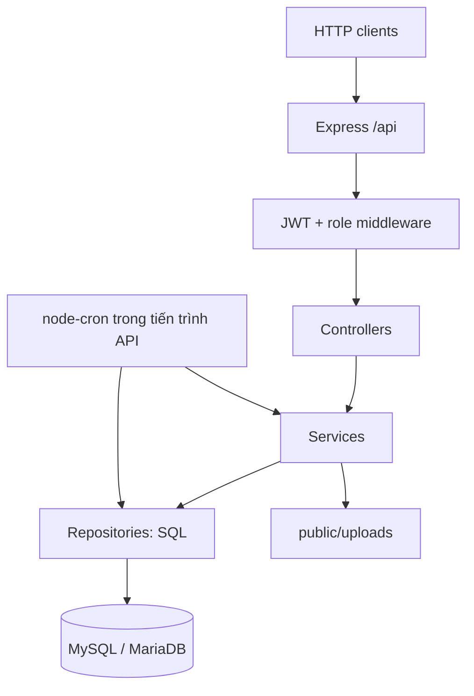

# Kiến trúc hiện tại — LCIT Meal API

> Phiên bản: 2.0 · Cập nhật: 25/09/2026.
>
> Mô tả mã nguồn hiện có, thay thế thiết kế đề xuất 1.0.
>
> Nguồn: `package.json`, `src/`, `sql/qlsa.sql`. Chưa xác minh database đang chạy hoặc nghiệm thu runtime.
>
> Đặc tả API và việc còn lại: [SPEC.md](SPEC.md).

build android
npx --yes eas-cli build -p android --profile preview --non-interactive

## 1. Phạm vi và cách đọc

API quản lý tài khoản, lịch bếp theo ngày, đăng ký ăn và khách, cắt suất, lịch nghỉ, thanh toán nhập thủ công, thông báo trong hệ thống, cấu hình và audit.

Tài liệu lấy câu lệnh thực thi và constants làm nguồn chính khi comment khác hành vi. “Hiện có” nghĩa là có triển khai trong repository, không đồng nghĩa đã qua kiểm thử. Lỗi và giới hạn được ghi riêng, không xem là quy tắc nghiệp vụ đã được phê duyệt.

Repository chỉ chứa backend; chưa xác minh công nghệ hoặc hành vi web/mobile. Flutter, Angular, ASP.NET Core, PostgreSQL, FCM và worker độc lập trong bản 1.0 không phải thành phần đã triển khai ở đây. Không dùng tài liệu này để tuyên bố đã đáp ứng workbook UC gốc.

## 2. Công nghệ

| Thành phần | Triển khai hiện tại | Nguồn |
|---|---|---|
| Runtime | Node.js, JavaScript CommonJS | `package.json` |
| HTTP | Express 5, CORS, JSON body tối đa 5 MB | `src/app.js` |
| Database | MySQL protocol qua mysql2/promise; pool tối đa 10 connection | `src/config/database.js` |
| Schema | SQL thủ công; dump gốc ghi MariaDB 10.4.28 | `sql/qlsa.sql` |
| Data access | SQL viết tay, placeholder tham số; không ORM | `src/repos/` |
| Authentication | jsonwebtoken, bcrypt; token hiện tại lưu trên user | AuthService, authMiddleware |
| Background jobs | node-cron cùng tiến trình API | `src/server.js`, `src/jobs/` |
| File | Multer memory storage; QR ghi vào public/uploads | SystemSettingRoutes/Service |
| Excel | Dependency exceljs, xlsx; có route xuất dữ liệu | package.json, routes, utilities |
| Logging | Console và audit_log | Middleware, services |

Phiên bản dependency theo package.json và lockfile. Chưa có bằng chứng tương thích mọi phiên bản MySQL/MariaDB. Bảng migration trong dump không chứng minh đã có migration runner trong ứng dụng.

## 3. Kiến trúc xử lý

Backend là monolith chia tầng. `src/modules/*/index.js` ghép repository, service, controller và router bằng constructor injection; không phải các module có database riêng.

| Thư mục | Trách nhiệm |
|---|---|
| src/config | Môi trường, database pool |
| src/constants | Role, trạng thái, khóa cấu hình, TTL |
| src/models | Mapping SQL sang object; User.toJSON loại trường nhạy cảm khỏi response |
| src/repos | Truy vấn và transaction cục bộ |
| src/services | Validation, điều phối nghiệp vụ, audit và thông báo |
| src/controllers | Đọc request/actor, trả response hoặc chuyển lỗi |
| src/routes, src/modules | Endpoint, kiểm role, ghép dependency |
| src/middlewares | Authentication, authorization, error handling |
| src/jobs | Sinh lịch/suất, hoàn thành suất, nhắc thanh toán |
| src/ultis | Response, pagination, Excel; tên thư mục thực tế là ultis |

Job gọi trực tiếp repository ở nhiều bước. Chưa có domain layer độc lập, eligibility service dùng chung hoặc transaction xuyên suốt nghiệp vụ–audit–thông báo.

## 4. Dữ liệu

Schema tham chiếu là toàn bộ [sql/qlsa.sql](sql/qlsa.sql), bao gồm các phần bổ sung cuối file. Bảng nghiệp vụ dùng ID số nguyên tự tăng; SQL dùng snake_case, object API thường dùng camelCase.

| Bảng | Vai trò và trường đáng chú ý |
|---|---|
| user | full_name, username, password_hash, auth_key, access_token, status |
| role, user_role | Vai trò và liên kết user–role |
| meal | meal_date, is_cancelled, cancelled_by, note, status |
| meal_registration | user_id, meal_id, guest_count, status |
| meal_option | type, from_date, to_date, note, trạng thái và người quyết định |
| meal_schedule_config | Các thứ được bố trí ăn trong tuần |
| holiday_event | Khoảng nghỉ, lý do, trạng thái, người tạo/mở lại |
| payment | payment_date, amount, is_paid, paid_amount, paid_at, bill_img, status |
| notification | Tiêu đề, nội dung, URL, trạng thái, người tạo/cập nhật |
| notification_recipient | Người nhận, is_seen, seen_at |
| system_setting | Key/value, kiểu dữ liệu, tên hiển thị, người cập nhật |
| audit_log | Actor, action, target, result, thời gian, IP, user agent, dữ liệu trước/sau |
| migration | Metadata có trong dump |

Có unique ngày bếp, cặp user–meal, username, role code, setting key và cặp user–role. Ràng buộc này hạn chế trùng hàng, không thay thế idempotency cho cả HTTP request.

Tiền dùng decimal(14,2); code có chuyển sang JavaScript Number. Chưa có giá snapshot, bảng giá theo hiệu lực, kỳ thu/khóa kỳ hoặc sổ phí. Ngày ăn dùng date; thời điểm chủ yếu datetime. Cron dùng Asia/Ho_Chi_Minh, nhưng có đoạn dùng UTC hoặc giờ DB; chưa thống nhất clock/timezone toàn hệ thống.

Schema có cascade delete từ user đến yêu cầu cắt, đăng ký và thanh toán; xóa meal cũng cascade đăng ký. Chưa bảo vệ toàn bộ lịch sử khi hard delete.

Không có Sessions, Enrollments, GuestRequests, BillingPeriods, MealCharges, MealPriceVersions, OutboxMessages, DeviceTokens hoặc JobRuns của thiết kế cũ.

## 5. Xác thực và quyền

Login kiểm trạng thái user, so sánh bcrypt, phát JWT chứa id và username với TTL 7d rồi ghi vào user.access_token. Request bảo vệ xác minh JWT, đọc user/roles hiện tại, kiểm active và so sánh token với DB. Logout đặt token null. Không có refresh endpoint, bảng phiên hoặc jti riêng; chưa chứng minh hai lần login cùng giây tạo token khác nhau.

Role gồm admin, manager, employee, kitchen. STAFF_ROLES gồm ba role đầu. Authorization kiểm danh sách role cụ thể, không so sánh thứ bậc số; chưa có permission catalog riêng.

| Nhóm API | Quyền route hiện có |
|---|---|
| Login | Public |
| Logout, sửa hồ sơ mình, dashboard | User đã xác thực |
| Users, roles: đọc | Admin/Manager |
| Users: tạo, batch, sửa, xóa, availability | Admin |
| Lịch bếp/lịch nghỉ: đọc | STAFF_ROLES |
| Tạo/sửa/hủy/mở bếp, tạo/mở lịch nghỉ | Admin/Manager; xóa meal chỉ Admin |
| Suất/yêu cầu cắt cá nhân | STAFF_ROLES; một số service kiểm ownership |
| Danh sách toàn bộ suất/cắt, duyệt | Admin/Manager |
| Payments: đọc toàn bộ, tạo/sửa/mark-paid | Admin/Manager; xóa chỉ Admin |
| Payments /me | STAFF_ROLES |
| Notifications: đọc/inbox | STAFF_ROLES; tạo/sửa/xóa/gửi chỉ Admin/Manager |
| Settings: đọc | STAFF_ROLES; ghi/QR chỉ Admin |
| Audit | Admin; chỉ có route đọc |

Đây là quyền vào route, không phải bằng chứng mọi dữ liệu đã giới hạn theo ownership. Dashboard trả dữ liệu tổng hợp và thanh toán toàn cơ quan cho mọi user đăng nhập. Một số API đọc theo ID hoặc tạo với userId chưa kiểm phạm vi đầy đủ. Kitchen không vào nhiều route nghiệp vụ nhưng vẫn nhận response dashboard này.

Service đăng ký/cắt trực tiếp chặn Admin tự thao tác suất của mình; quy tắc chưa áp dụng đồng nhất mọi luồng. Job sinh suất vẫn lọc tất cả user active, không loại theo role.

## 6. Nghiệp vụ suất ăn

### 6.1. Ngày bếp và sinh suất

Một ngày tối đa một meal. Trạng thái nghỉ dùng is_cancelled; không áp dụng state machine lưu trữ OPEN/LOCKED/COMPLETED của bản 1.0. Một số query trả completionStatus suy ra theo ngày/giờ.

Tạo meal qua service chỉ tạo lịch và audit. Sinh suất ở autoScheduleJob hoặc endpoint chạy job: xử lý cả tháng được chọn, lọc lịch thứ trong tuần nếu bật cấu hình, xét holiday, bỏ meal đã hủy rồi tạo confirmed cho user active chưa có hàng và không có cắt approved bao phủ. Giữ nguyên hàng đăng ký đã tồn tại ở bất kỳ trạng thái nào. Không có enrollment/ngày hiệu lực tham gia ăn.

### 6.2. Đăng ký và khách

Registration có pending, confirmed, completed, cancelled. POST tạo mới, kích hoạt lại hàng cancelled hoặc cập nhật số khách trên hàng hiện có; gửi lại đăng ký chưa cancelled với cùng số khách trả 409.

Khách là guestCount trên suất; validation kiểm giới hạn 0–10 nhưng chưa bảo đảm số nguyên hợp lệ đầy đủ. Create chuyển ngay confirmed dù có khách, rồi thông báo quản lý; không duyệt khách riêng. Create kiểm bếp hủy và ngày quá khứ bằng ngày UTC; không gọi helper giờ đóng đăng ký trong luồng này.

### 6.3. Hai luồng cắt đang cùng tồn tại

**meal-options:** cancel_today thuộc AUTO_APPROVE_TYPES (tự động duyệt trước giờ đóng); cancel_schedule (khoảng ngày tùy chỉnh) và cancel_permanent (dài hạn) ở trạng thái pending chờ Quản lý duyệt. Khi duyệt, hệ thống đồng bộ hủy suất trong khoảng. Cả ba bắt buộc fromDate/toDate; “permanent” vẫn là khoảng hữu hạn. TODAY không bị server ép ngày về hôm nay. Giờ đóng được kiểm nếu fromDate đúng hôm nay. Quản lý duyệt/từ chối qua API approve/reject.

**meal-registrations/:id/cancel:** kiểm chủ sở hữu/quản lý, chặn completed, ngày quá khứ hoặc quá giờ hoàn thành. Trước giờ đóng hủy ngay; sau giờ đóng nhưng trước hoàn thành, Employee chuyển chính registration sang pending. Admin/Manager có thể cắt ngay trong khoảng này. Approve-cancel đưa pending → cancelled; reject-cancel đưa pending → confirmed.

Hai luồng có validation/trạng thái khác nhau. Query hủy khoảng chọn mọi suất chưa cancelled, kể cả completed; chưa có bảo vệ lịch sử/version/khóa cạnh tranh thống nhất. Route meal-options/:id/reactivate gọi method chưa tồn tại trong service, nên chưa hoàn chỉnh.

### 6.4. Hủy/mở bếp và lịch nghỉ

Hủy meal riêng cập nhật cờ, audit và báo người đã đăng ký; không đồng bộ hủy suất. Restore meal chỉ mở cờ. Các bước không cùng transaction.

Holiday event tạo/hủy meal trong khoảng, hủy đăng ký chưa cancelled và gửi thông báo. Restore mở meal và khôi phục mọi đăng ký cancelled trong khoảng về confirmed; không phân biệt hủy do sự kiện với tự cắt cá nhân, nên có thể phục hồi nhầm.

### 6.5. Hoàn thành

Job cập nhật confirmed → completed theo ngày; chạy lại không đổi hàng đã completed. Query chưa loại meal bị hủy. Không tạo phí/hóa đơn. Các luồng khác vẫn có thể sửa/hủy completed, nên trạng thái này chưa bất biến toàn hệ thống.

## 7. Dashboard, thanh toán, thông báo và cấu hình

Dashboard có hôm nay, biểu đồ tuần/tháng/năm, payment gần nhất theo user, tổng nợ, badge cắt pending và inbox chưa xem. Biểu đồ đếm completed và xử lý ngày trống. Summary registration đếm confirmed và cộng guest_count; query tổng hợp khác có điều kiện riêng. Chưa có scope dashboard theo role.

Payment do Admin/Manager nhập với ngày, amount và status. Mark-paid đặt is_paid=1, paid_amount (mặc định amount), thời điểm, đường dẫn bill_img. Không suy trạng thái từ ledger, không có thu nhiều lần/đảo/khóa kỳ hoặc hóa đơn tự tính từ suất. Admin có thể xóa payment.

Thông báo lưu DB trực tiếp với recipient và trạng thái đã xem. Broadcast lấy user active lúc gọi. Inbox /me, seen và seen-all dùng user hiện tại; route đọc chung chưa giới hạn recipient. Chưa FCM/device API/outbox/retry bền vững.

Batch user nhận JSON { users: [...] }, validate và hash password trước khi tạo user/role trong transaction. Không endpoint upload Excel hoặc validate–preview–commit theo batch ID. Có xuất Excel cho đăng ký và thanh toán.

Settings là key/value có metadata kiểu. Bulk cập nhật từng key tuần tự, không rollback toàn batch. QR nhận multipart field file, tối đa 5 MB, MIME PNG/JPEG/WebP; server đặt tên file rồi cập nhật payment_qr_image. File phục vụ qua /uploads; chưa kiểm nội dung ảnh bằng decoder.

Audit được service ghi sau thao tác; nhiều nơi bắt lỗi và chỉ console.error. Không bảo đảm audit thành công commit cùng nghiệp vụ.

## 8. Job và vận hành

| Job | Cách chạy và giới hạn |
|---|---|
| autoScheduleJob | Cron 20:00, chỉ thực thi đúng auto_register_start_day; tạo tháng hiện tại khi auto_register_enabled. Chạy bù khi khởi động đúng ngày sau 20:00; API cho chọn tháng |
| mealCompletionJob | Poll 5 phút, so với meal_completion_time (fallback 12:00); xử lý hôm nay, có catch-up cùng ngày và API chọn ngày |
| paymentReminderJob | 09:00; xét enabled/due-day; chọn unpaid/overdue gần nhất mỗi user, chuyển unpaid sang overdue, kiểm đã nhắc hôm nay |

Job bắt đầu trong callback app.listen. Không worker riêng, distributed lease hoặc job state trong DB. Completion đặt lastRunDate trước khi chạy; nếu lỗi thì không tự retry cùng ngày trong tiến trình đó. Không tự quét mọi ngày bỏ lỡ sau downtime. Nhiều API instance có thể cùng chạy cron.

Chạy dev bằng npm run dev, chạy ứng dụng bằng npm start. Env gồm PORT, DB_HOST, DB_PORT, DB_USER, DB_PASSWORD, DB_NAME, JWT_SECRET. CORS hiện cho http://localhost:5173. GET / chỉ báo API chạy, không kiểm DB/job. Chưa thấy test script, CI, container/HTTPS deployment, metrics hoặc runbook backup/restore trong repository.

## 9. Hợp đồng và giới hạn

Prefix /api, Authorization: Bearer token. Response chuẩn { success, payload, error }, không phải Problem Details; error gồm code và message, chưa có traceId/field errors thống nhất. Một số list cắt mảng trong memory, một số filter phân trang SQL. Chi tiết ở [SPEC.md](SPEC.md).

Enrollment, guest approval, ledger, outbox, idempotency middleware và permission catalog của thiết kế cũ là lựa chọn mở rộng, không phải thành phần hiện tại. Các vấn đề quyền, completed, cascade delete và retry là giới hạn triển khai; xem GAP trong SPEC.
